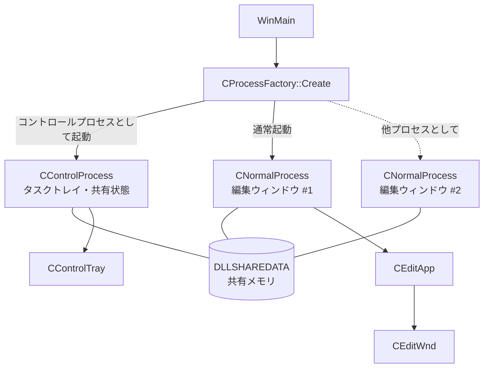
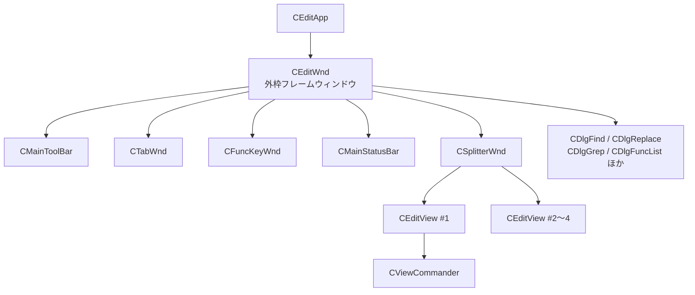
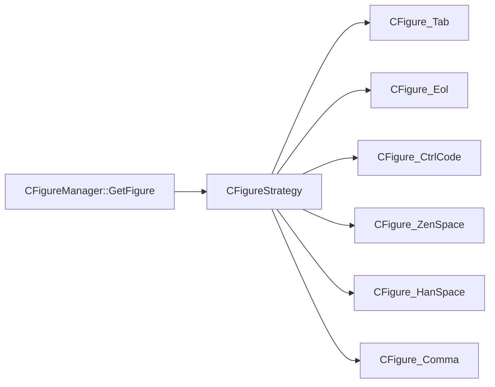

# サクラエディタ アーキテクチャ

この文書はサクラエディタのコードベース全体の構造を説明します。
初めてコードを読む人が「どこに何があるか」「なぜそうなっているか」を掴むための地図です。

個々の関数の使い方ではなく、**サブシステムの境界と、その間をデータがどう流れるか**に焦点を当てています。

- 対象コミット時点の `sakura_core/` 以下の実装に基づきます
- ビルド手順は [`tools/build.md`](tools/build.md)、開発の進め方は [`CONTRIBUTING.md`](CONTRIBUTING.md) を参照してください

---

## 1. 全体像

サクラエディタは C++20 で書かれた Windows 専用のテキストエディタです。
UI は Win32 コモンコントロールと GDI による直接描画で構築されています。

最も特徴的なのは**二プロセスモデル**です。ウィンドウを何枚開いても、
アプリケーション全体の共有状態を持つプロセスは常に 1 つだけになります。



| プロセス | 実体 | 役割 |
|---|---|---|
| コントロールプロセス | `CControlProcess` | システム全体で 1 つ。タスクトレイに常駐し、共有状態と設定の永続化を担う。`CControlTray` を所有 |
| エディタプロセス | `CNormalProcess` | 編集ウィンドウ 1 枚につき 1 プロセス。`CEditApp` → `CEditWnd` を作る |

### 起動時の分岐

`CProcessFactory::Create()`（`_main/CProcessFactory.cpp`）がコマンドラインを見て
どちらのプロセスを作るか決めます。エディタプロセスの起動時にコントロールプロセスが
存在しなければ、先にそれを起動します。

ここには意図的に緩い設計が入っています。`IsExistControlProcess()` は
「コントロールプロセスが起動して `CreateMutex()` を実行し終えるまで」の間も
false を返すため、**複数のノーマルプロセスが同時に起動すると
コントロールプロセスも複数起動しうる**という前提で書かれています。
最初にミューテックスを確保した 1 つだけが生き残るので結果は正しくなります
（この事情は `CProcessFactory.cpp` のコメントに明記されています）。

---

## 2. プロセス間の状態共有

二プロセスモデルを成り立たせているのが共有メモリです。

- `DLLSHAREDATA`（`env/DLLSHAREDATA.h`）— 全プロセスが自分のアドレス空間に
  マップする 1 つの構造体
- `CShareData`（`env/CShareData.h`）— そのマッピングを管理するクラス
- `CShareData_IO`（`env/CShareData_IO.cpp`）— ini ファイルへの読み書き

`DLLSHAREDATA` は先頭に `m_vStructureVersion` を持ちます。これは
**データ構造が異なるバージョンの同時起動を防ぐため**のもので、
必ず先頭になければならないとコメントで指定されています。

構造体は大きく「非保存対象」と「保存対象」に分かれます。

| 区分 | 主な内容 |
|---|---|
| 非保存対象 | `m_sWorkBuffer`（プロセス間のデータ受け渡し用）、`m_sFlags`、`m_sNodes`、`m_sHandles`、文字幅キャッシュ |
| 保存対象 | `m_Common`（共通設定）、`m_TypeBasis` / `m_TypeMini`（タイプ別設定）、印刷設定、検索履歴、タグジャンプ履歴 |

> **共有データにメンバを追加するときの注意**
> `DLLSHAREDATA` のレイアウトが変わるため、`config/system_constants.h` の
> `N_SHAREDATA_VERSION` をインクリメントする必要があります。
> この値は共有メモリ名やミューテックス名にも埋め込まれており、
> 旧バージョンとの同時起動を防ぐ仕組みになっています。

プロセス間の通知は `MYWM_*` のウィンドウメッセージで行います。
たとえば設定変更は `MYWM_CHANGESETTING` を各ウィンドウへ送って反映させます。

---

## 3. ウィンドウ構成



`CEditWnd`（`window/CEditWnd.h`）が外枠フレームで、ツールバー・タブ・
ファンクションキーバー・ステータスバー・分割フレーム、そして各種ダイアログを
メンバとして直接抱えています。

`CEditView` は分割ペインに対応して**最大 4 つ**まで作られます
（`m_nEditViewMaxCount`、`CEditViewsArray` の要素数から決まります）。
各ビューが自分の `CViewCommander` を持ちます。

`CEditView` の実装は責務ごとにファイル分割されています
（`CEditView_Paint.cpp`、`CEditView_Mouse.cpp`、`CEditView_Ime.cpp`、
`CEditView_Scroll.cpp`、`CEditView_Search.cpp` など）。

---

## 4. 文書モデル — 論理行とレイアウト行

サクラエディタで最も理解が必要なのがこの二層構造です。


| 層 | クラス | 単位 | 置き場所 |
|---|---|---|---|
| 論理 | `CDocLineMgr` / `CDocLine` | ファイル上の 1 行（改行で区切られる行） | `doc/logic/` |
| レイアウト | `CLayoutMgr` / `CLayout` | 画面上の 1 行（折り返しやタブ展開の結果） | `doc/layout/` |

折り返しが有効なとき、論理行 1 本が複数のレイアウト行に対応します。
`CLayoutMgr::Create( CEditDoc*, CDocLineMgr* )` が示すとおり、
**レイアウト層は論理層の上に構築される**一方向の依存です。

編集操作は論理行に対して行い、その結果レイアウトが再計算されます。
カーソル移動やスクロールはレイアウト行が基準になります。

### 文書サブシステムの集約

`CEditDoc`（`doc/CEditDoc.h`）が文書に関するすべてを集約します。

| メンバ | 責務 |
|---|---|
| `m_cDocLineMgr` | 論理行の格納 |
| `m_cLayoutMgr` | レイアウト行の管理 |
| `m_cDocEditor` | 編集操作（Undo バッファを保持） |
| `m_cDocFile` | ファイルパスと文字コードのメタ情報 |
| `m_cDocFileOperation` | 開く・閉じる・保存 |
| `m_cDocType` | タイプ別設定（言語モード）の対応付け |
| `m_cDocOutline` | アウトライン解析 |
| `m_cDocLocker` | 排他制御 |
| `m_cBackupAgent` / `m_cAutoSaveAgent` / `m_cAutoReloadAgent` | 背景処理（後述） |

---

## 5. 座標系の型安全性

論理行とレイアウト行という 2 つの座標系があるため、
**取り違えをコンパイル時に検出する仕組み**が入っています（`basis/SakuraBasis.h`）。

```cpp
#ifdef USE_STRICT_INT
    typedef CStrictInteger< 0, true, true, true,  true > CLogicInt;   // ロジック単位
    typedef CStrictInteger< 1, true, true, false, true > CLayoutInt;  // レイアウト単位
#else
    typedef int CLogicInt;
    typedef int CLayoutInt;
#endif
```

`CStrictInteger` の第 1 引数（`0` と `1`）が型を区別するタグです。
これにより `CLogicInt` と `CLayoutInt` は別の型になり、
うっかり混ぜると型エラーになります。

`CLayoutInt` だけ第 4 引数（int への暗黙変換）が `false` になっている点に注意してください。
レイアウト単位のほうがより厳格です。

ここから `CLogicPoint` / `CLayoutPoint`、`CLogicRect` / `CLayoutRect` が組み立てられます。

> **`USE_STRICT_INT` は MSVC の Debug ビルドでのみ定義されます**（`config/build_config.h`）。
> リリースビルドでは単なる `int` に落ちるので、この型チェックの恩恵を受けるには
> Debug ビルドを通す必要があります。

---

## 6. コマンドディスパッチ

エディタの操作はすべて `EFunctionCode` という 1 つの列挙で表現されます。

### 機能番号の体系

| 範囲 | 用途 |
|---|---|
| `0`〜`10` | 特別値（`F_DISABLE`、`F_SEPARATOR`、`F_PLUGCOMMAND` など予約） |
| `20000`〜`21999` | プラグインコマンド（20 個 × 100） |
| `29001`〜 | 動的リスト（ウィンドウ一覧、最近使ったファイルなど） |
| `30000`〜`32767` | メニュー・キーに割り当て可能な機能番号 |
| `40000`〜`49511` | マクロ関数 |

機能番号には修飾フラグを OR できます（`FA_FROMMACRO` = マクロからの実行、
`FA_NONRECORD` = マクロへの記録を抑制）。

### 定義の生成

機能番号は `sakura_core/Funccode_x.hsrc` を単一の情報源として、
`src/main/py/header_make.py` が 2 つのヘッダを生成します。

```
Funccode_x.hsrc ──header_make.py──┬─> Funccode_define.h  (-mode=define)
                                  └─> Funccode_enum.h    (-mode=enum -enum=EFunctionCode)
```

**機能を追加するときは `.hsrc` を編集します。** 生成物を直接編集しても
ビルドのたびに上書きされます。

### 振り分け

`CViewCommander::HandleCommand()`（`cmd/CViewCommander.cpp`）が中央のディスパッチャです。
実装は機能のカテゴリごとにファイル分割されています。

```
cmd/CViewCommander_Edit.cpp        編集
cmd/CViewCommander_File.cpp        ファイル操作
cmd/CViewCommander_Cursor.cpp      カーソル移動
cmd/CViewCommander_Search.cpp      検索
cmd/CViewCommander_Clipboard.cpp   クリップボード
cmd/CViewCommander_Macro.cpp       マクロ
...
```

---

## 7. 編集と Undo

Undo は `cmd/` に置かれた 3 段構造で実装されています。

| クラス | 粒度 |
|---|---|
| `COpe` | 1 つの編集操作 |
| `COpeBlk` | 1 回の Undo で戻る操作のまとまり |
| `COpeBuf` | 操作ブロックの履歴バッファ |

`CDocEditor` が `COpeBuf m_cOpeBuf` を持ち（`doc/CDocEditor.h`）、
`IsEnableUndo()` / `IsEnableRedo()` はここへ委譲されます。

つまり「Undo の状態を持っているのは文書側、操作の型定義はコマンド側」という配置です。

---

## 8. テキスト描画

本文の描画は `view/` にあります。中心は `CEditView_Paint.cpp` で、
GDI の `ExtTextOut` などを直接呼びます。

特殊文字の描画には **Strategy パターン**が使われています（`view/figures/`）。



`CFigureManager::GetFigure( pText, nTextLen )` が文字列の先頭を見て
適切な `CFigure` を返し、それが描画を担当します。
タブ・改行・制御コード・全角空白・半角空白などの「見える化」がここで行われます。

描画まわりのその他の要素:

| クラス | 責務 |
|---|---|
| `CTextArea` | 本文の描画領域 |
| `CTextDrawer` / `CTextMetrics` | 描画と寸法計算 |
| `CRuler` | ルーラー |
| `CCaret` | キャレット |
| `CMiniMapView` | ミニマップ |
| `CViewFont` | フォント管理 |

### DPI とダークモード

- DPI スケーリングは `util/window.h` の `CDPI` と、そのフリー関数
  `DpiScaleX()` / `DpiScaleY()` などを通します
- ダークモードは外部ライブラリ `externals/darkmodelib` に委譲し、
  `apiwrap/DarkMode.h` の `IsDarkModeActive()` / `ApplyDarkModeSetting()` で
  判定と適用を一箇所に集約しています

---

## 9. 文字コード

文字コードの変換は `charset/` にあり、`CCodeBase` を基底とする
クラス群を `CCodeFactory` が生成します。

```cpp
// charset/CCodeFactory.cpp
case CODE_SJIS:      return new CShiftJis();
case CODE_EUC:       return new CEuc();
case CODE_JIS:       return new CJis((nFlag&1)==1);
case CODE_UNICODE:   return new CUnicode();
case CODE_UTF8:      return new CUtf8();
case CODE_UTF7:      return new CUtf7();
case CODE_UNICODEBE: return new CUnicodeBe();
case CODE_CESU8:     return new CCesu8();
case CODE_LATIN1:    return new CLatin1();
case CODE_CPACP:     return new CCodePage(eCodeType);
case CODE_CPOEM:     return new CCodePage(eCodeType);
```

`CCodeBase` の中核は 2 つの純粋仮想関数だけです。

```cpp
virtual EConvertResult CodeToUnicode(const CMemory& cSrc, CNativeW* pDst) = 0;
virtual EConvertResult UnicodeToCode(const CNativeW& cSrc, CMemory* pDst) = 0;
```

**内部表現は UTF-16（`CNativeW`）で統一**され、入出力の境界でのみ変換します。
新しい文字コードを足したい場合は `CCodeBase` の派生クラスを作り、
`CCodeFactory` に 1 行足すのが基本形です。

文字コードの自動判別は `CCodeMediator` と `CESI` が担当します。

---

## 10. 拡張機構

### マクロ（`macro/`）

複数のマクロエンジンがあります。

| 種類 | クラス |
|---|---|
| キーマクロ | `CKeyMacroMgr` |
| PPA | `CPPAMacroMgr` / `CPPA` |
| Python | `CPythonMacroManager` |
| WSH（JScript / VBScript） | `CWSH` 系 |

振り分けは `CMacroFactory::Create( ext )` が行います。**拡張子をキーに、
登録済みの生成関数を順に試して最初に応答したものを使う**という
オープンな仕組みで、`switch` による固定的な分岐ではありません。
エンジンを足す場合は生成関数を登録します。

マクロから見えるオブジェクトモデルは `CIfObj` / `CEditorIfObj` が提供します。

### プラグイン（`plugin/`）

DLL プラグイン（`CDllPlugin`）と WSH プラグイン（`CWSHPlugin`）があり、
`CPluginManager` が読み込みを管理します。

拡張ポイントは **ジャック（Jack）** と呼ばれ、`CJackManager` が仲介します。

| ジャック | 発火タイミング |
|---|---|
| `PP_COMMAND` | プラグインコマンド実行 |
| `PP_EDITOR_START` / `PP_EDITOR_END` | エディタの開始・終了 |
| `PP_DOCUMENT_OPEN` / `PP_DOCUMENT_CLOSE` | 文書の開閉 |
| `PP_DOCUMENT_BEFORE_SAVE` / `PP_DOCUMENT_AFTER_SAVE` | 保存の前後 |
| `PP_OUTLINE` | アウトライン解析 |
| `PP_SMARTINDENT` | スマートインデント |
| `PP_COMPLEMENT` / `PP_COMPLEMENTGLOBAL` | 入力補完 |

`CJackManager.h` のコメントによれば、アプリ全体のイベント
（`PP_APP_START` など）は「エディタごとにプラグインを管理している」構造上
扱いにくいためコメントアウトされています。これは二プロセスモデルの帰結です。

---

## 11. 背景処理（`agent/`）

時間駆動・非同期の処理はエージェントとして切り出されています。

| クラス | 役割 |
|---|---|
| `CAutoSaveAgent` | 自動保存 |
| `CAutoReloadAgent` | 外部更新の検出と再読み込み |
| `CBackupAgent` | バックアップ生成 |
| `CLoadAgent` / `CSaveAgent` | 読み込み・保存の実処理 |
| `CGrepAgent` | Grep 実行 |
| `CSearchAgent` | 検索実行 |

このうち `CAutoSaveAgent` / `CAutoReloadAgent` / `CBackupAgent` は
`CEditDoc` のメンバとして文書に紐づきます。

---

## 12. 設定

設定は 2 階層です。

| 階層 | 構造体 | 編集画面 | 実装 |
|---|---|---|---|
| 共通設定 | `CommonSetting`（`env/CommonSetting.h`） | 共通設定ダイアログ | `prop/CPropCom*.cpp` |
| タイプ別設定 | `STypeConfig` / `STypeConfigMini` | タイプ別設定ダイアログ | `typeprop/` |

どちらも `DLLSHAREDATA` に載って全プロセスで共有され、
`CShareData_IO` が ini ファイルとの間で読み書きします。

### 共通設定に項目を 1 つ追加する手順

既存の項目にならうのが最も確実です。たとえば `m_bDarkMode` は次の 5 箇所に現れます。

1. `env/CommonSetting.h` — 構造体にメンバを追加
2. `env/CShareData.cpp` — 既定値を設定
3. `env/CShareData_IO.cpp` — `IOProfileData()` で ini 入出力
4. `prop/CPropComWin.cpp` — ダイアログとの間で読み書き
5. `sakura_core/sakura_rc.rc` と `sakura_lang/` の各言語リソース — コントロールを追加

加えて `N_SHAREDATA_VERSION` の更新が必要です（第 2 章参照）。

### タイプ別設定（言語モード）

言語ごとの定義は `types/` にあります（`CType_Cpp.cpp`、`CType_Python.cpp` など）。
キーワードや色分けのルールをここで定義します。

---

## 13. ローカライズ

- `sakura_core/sakura_rc.rc` が日本語のリソースで、**これが基準**です
- `sakura_lang/` に en-US と zh-CN のリソース専用 DLL があり、
  それぞれ独立した vcxproj（`sakura_lang_en_US.vcxproj` など）でビルドされます
- 実行時の切り替えは `CSelectLang` が担当し、
  共通設定の `m_szLanguageDll` で選択します

**リソースを変更するときは 3 つすべてを揃える必要があります。**
言語 DLL 側は `sakura_rc.h` を include しているため、
片方だけにコントロールを足すとビルドが通りません。

> **エンコーディング制約**
> CI の `src/main/py/check_encoding.py` が拡張子ごとの文字コードを検査します。
> `.cpp` / `.h` は UTF-8 BOM 付き（または ASCII）、`.rc` / `.rc2` は UTF-16 が必須です。
> 検査対象は `origin/master` からの差分ファイルのみです。

---

## 14. ディレクトリ構成

| ディレクトリ | 責務 |
|---|---|
| `sakura_core/_main/` | エントリポイント、プロセスクラス、グローバル状態 |
| `sakura_core/_os/` | OS 抽象化（クリップボード、ドロップターゲットなど） |
| `sakura_core/basis/` | 基本型（`CLogicInt` / `CLayoutInt` などの単位型） |
| `sakura_core/window/` | ウィンドウ（`CEditWnd`、`CTabWnd`、ツールバー、ステータスバー） |
| `sakura_core/view/` | 編集ビュー（`CEditView`、キャレット、ルーラー、描画） |
| `sakura_core/view/figures/` | 特殊文字の描画ストラテジ |
| `sakura_core/cmd/` | コマンド実装（`CViewCommander_*.cpp`）と Undo（`COpe*`） |
| `sakura_core/doc/` | 文書モデル（`logic/`、`layout/`、ファイル操作、タイプ） |
| `sakura_core/env/` | 環境管理（共有データ、キーワードセット、文書タイプ） |
| `sakura_core/prop/` | 共通設定ダイアログ |
| `sakura_core/typeprop/` | タイプ別設定ダイアログ |
| `sakura_core/types/` | 言語定義 |
| `sakura_core/macro/` | マクロ（キーマクロ、PPA、Python、WSH） |
| `sakura_core/plugin/` | プラグイン機構 |
| `sakura_core/agent/` | 背景処理エージェント |
| `sakura_core/grep/` | Grep のファイル走査 |
| `sakura_core/charset/` | 文字コード判別と変換 |
| `sakura_core/extmodule/` | 外部ライブラリのラッパ（正規表現、Migemo） |
| `sakura_core/func/` | 機能テーブル、キー割り当て |
| `sakura_core/apiwrap/` | Win32 API のラッパ（`DarkMode.h`、`StdControl.h` など） |
| `sakura_core/uiparts/` | UI 部品（イメージリスト、メニュー描画、グラフィックス） |
| `sakura_core/util/` | ユーティリティ。`design_template.h` が `TSingleton` などを提供 |
| `externals/` | third-party（git submodule） |
| `sakura_lang/` | 言語リソース DLL |
| `src/main/py/` | ビルド用スクリプト（ヘッダ生成、エンコーディング検査） |
| `src/test/cpp/tests1/` | 単体テスト（GoogleTest） |

### 共通イディオム

`util/design_template.h` が提供します。

| 名前 | 用途 | 実際の使用箇所 |
|---|---|---|
| `TSakuraSingleton<T>` | インスタンスを自動生成するシングルトン。**現在の主流** | 16 ヘッダ |
| `TSingleInstance<T>` | インスタンスを自動生成しない変則シングルトン。生成は所有者側が行う | 5 ヘッダ |
| `TInstanceHolder<T>` | インスタンス保持 | 3 ヘッダ |
| `TSingleton<T>` | 関数内 static による素朴なシングルトン | **未使用** |
| `DISALLOW_COPY_AND_ASSIGN` | コピー・ムーブの禁止 | — |

新しくシングルトンが必要になった場合は `TSakuraSingleton` にならうのが無難です。
`TSingleton` は定義が残っているだけで、利用箇所はありません
（`TSingletonを廃止する` というコミットで置き換えが進められました）。

---

## 15. 外部依存

外部依存の入手経路は 3 通りあり、`externals/` にあるからといって
すべてが submodule というわけではありません。

### git submodule（`.gitmodules`）

| ライブラリ | 用途 |
|---|---|
| `Onigmo` / `bregonig` | 正規表現エンジン |
| `cmigemo` | Migemo（ローマ字での日本語インクリメンタル検索） |
| `ctags` | タグジャンプ |
| `darkmodelib` | ダークモード対応 |
| `miniz-cpp` | ZIP 処理（テストのみ） |
| `tools/vcpkg` | vcpkg 本体 |

### リポジトリに直接コミットされた ZIP

submodule ではなく、`externals/` 配下にアーカイブが置かれています。

| 場所 | 用途 | 展開 |
|---|---|---|
| `externals/diffutils/` | 差分表示（`diffutils-2.8.7-1-bin.zip` ほか） | `src/main/cmake/diffutils.cmake` |
| `externals/cmigemo-dict/` | Migemo 辞書（cp932 / utf-8） | — |
| `externals/LocaleEmulator/` | CHM ビルド時に CI が使う | `build-sakura.yml` |

### vcpkg（`vcpkg.json`）

```json
"dependencies": [ "bregonig", "cmigemo",
                  { "name": "darkmodelib", "platform": "static" },
                  "dll-plugin1",
                  { "name": "gtest", "platform": "static" },
                  "ppa-stub" ]
```

**単体テストの googletest は submodule ではなく vcpkg 経由です**
（`src/test/cmake/tests1.cmake` が `GTest::gtest` にリンクします）。

`bregonig` / `cmigemo` / `darkmodelib` は submodule と vcpkg の
両方に名前が出てきます。ビルド構成によってどちらが使われるかが変わるため、
このあたりを触るときは `src/main/cmake/` の該当スクリプトを確認してください。

---

## 16. ビルドの構造

同じソースに対して 2 つのビルド系があります。

| 系統 | 入口 | 位置づけ |
|---|---|---|
| MSVC | `sakura.sln` / `build-sln.bat` | **主系**。`sakura_core/sakura.vcxproj` がソースを明示列挙する |
| CMake（MinGW） | `CMakeLists.txt` / `src/main/cmake/sakura.cmake` | 実験的。ソースを `GLOB_RECURSE` で収集する |

> **ソースファイルを新規追加するときは `sakura.vcxproj` への追記が必要です。**
> CMake 側は glob なので自動的に拾われますが、MSVC 側は明示列挙のため
> 追記を忘れるとリンクエラーになります。ヘッダのみのファイルなら不要です。

### ビルド時に生成されるもの

| 生成物 | 生成元 |
|---|---|
| `Funccode_define.h` / `Funccode_enum.h` | `src/main/py/header_make.py` ← `Funccode_x.hsrc` |
| `version.h` | `src/main/cmake/version.cmake` ← `src/main/cmake/version.h.in` |
| `githash.h` | `tools/githash.bat`（`SKIP_CREATE_GITHASH=1` で抑止可能。リファクタ前後でバイナリを比較したいときに使う） |
| `sakura.exe.manifest` | CMake（`generate_sakura_exe_manifest` ターゲット） |

生成先は CMake のビルドディレクトリ（`${CMAKE_BINARY_DIR}`）です。
`Funccode_*.h` は手で編集してもビルドのたびに上書きされます。

### CI

`.github/workflows/` にあります。

| ワークフロー | 内容 |
|---|---|
| `build-sakura.yml` | MSBuild で {Win32, x64} × {Debug, Release} の 4 通り。`Exe` / `Installer` を artifact として出力 |
| `build-on-msys2.yml` | MinGW で {Debug, Release} |
| `cppcheck.yml` | 静的解析 |
| `sonarscan.yml` | SonarQube |
| `doxygen.yml` | API ドキュメント生成 |

`build-sakura.yml` の先頭では `check-encoding` ジョブが走り、
第 13 章のエンコーディング規約を検査します。ここで落ちると後続はすべて実行されません。

---

## 付録: 変更を加えるときの入口

| やりたいこと | 見る場所 |
|---|---|
| 新しいコマンドを追加する | `Funccode_x.hsrc` → `cmd/CViewCommander_*.cpp` |
| 共通設定に項目を足す | 第 12 章の 5 箇所 + `N_SHAREDATA_VERSION` |
| 新しい言語（シンタックス）を足す | `types/CType_*.cpp` |
| 新しい文字コードを足す | `charset/CCodeBase.h` の派生 + `CCodeFactory` |
| 本文の描画を変える | `view/CEditView_Paint.cpp`、`view/figures/` |
| ウィンドウ枠まわりの UI を変える | `window/CEditWnd.cpp` と各 `window/C*.cpp` |
| プラグインの拡張点を増やす | `plugin/CJackManager.h` の `PP_*` |
