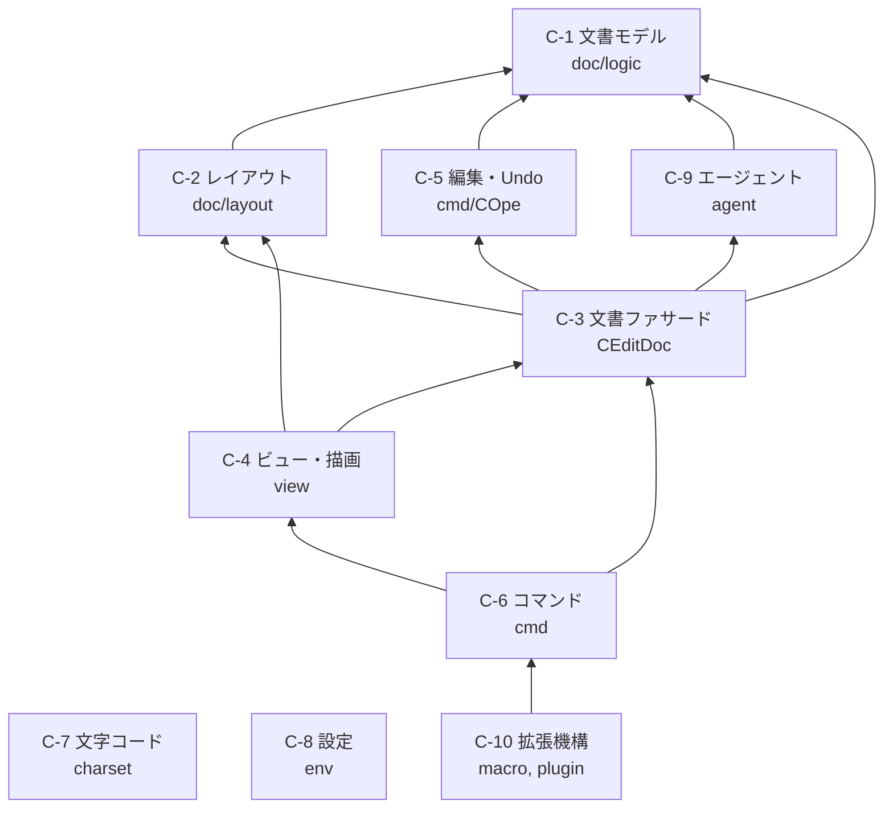

# サクラエディタ コンポーネント設計書

| 項目 | 内容 |
|---|---|
| 文書種別 | コンポーネント設計書 |
| 対象 | 主要サブシステム 10 個 |
| 関連文書 | [要求仕様書](requirements.md) / [アーキテクチャ設計書](architecture.md) |

[アーキテクチャ設計書](architecture.md) がサブシステム**間**の関係を扱うのに対し、
本書は各サブシステムの**内部**を扱います。

対象は主要な 10 個に絞りました。周辺的なもの（印刷、アウトライン解析、
差分表示など）は含みません。

各節は次の構成です。

- **責務** — 何を担当するか
- **主要クラス** — 構成要素
- **内部構造** — データ構造とアルゴリズム
- **拡張点** — 手を入れるときの入口
- **注意点** — 実装上の落とし穴

---

## コンポーネント一覧

| # | コンポーネント | 主なディレクトリ | 依存先 |
|---|---|---|---|
| C-1 | [文書モデル](#c-1-文書モデル) | `doc/logic/` | なし |
| C-2 | [レイアウト層](#c-2-レイアウト層) | `doc/layout/` | C-1 |
| C-3 | [文書ファサード](#c-3-文書ファサード) | `doc/` | C-1, C-2, C-5, C-9 |
| C-4 | [ビューと描画](#c-4-ビューと描画) | `view/` | C-2, C-3 |
| C-5 | [編集と Undo](#c-5-編集と-undo) | `cmd/COpe*` | C-1 |
| C-6 | [コマンドディスパッチ](#c-6-コマンドディスパッチ) | `cmd/`, `func/` | C-3, C-4 |
| C-7 | [文字コード](#c-7-文字コード) | `charset/` | なし |
| C-8 | [設定](#c-8-設定) | `env/`, `prop/`, `typeprop/` | なし |
| C-9 | [背景処理エージェント](#c-9-背景処理エージェント) | `agent/` | C-1, C-3 |
| C-10 | [拡張機構](#c-10-拡張機構) | `macro/`, `plugin/` | C-6 |

依存の向きは概ね「下位（C-1, C-7, C-8）→ 上位（C-4, C-6）」の一方向です。
C-1 が何にも依存していない点が重要で、論理層は単体で完結しています。

---

## C-1: 文書モデル

### 責務

ファイル上の 1 行（改行で区切られた行）を単位として、テキスト実体を保持する。
折り返しやタブ展開といった**表示の都合を一切持たない**。

### 主要クラス

| クラス | 役割 |
|---|---|
| `CDocLine` | 論理行 1 本 |
| `CDocLineMgr` | 論理行の集合 |

### 内部構造

`CDocLineMgr` は `CDocLine` の**双方向連結リスト**として実装されています。

```
m_pDocLineTop → [CDocLine] ⇄ [CDocLine] ⇄ ... ⇄ [CDocLine] ← m_pDocLineBot
```

| メンバ | 内容 |
|---|---|
| `CDocLineMgr::m_pDocLineTop` | 先頭行 |
| `CDocLineMgr::m_pDocLineBot` | 最終行（1 行のみのときは Top と同一） |
| `CDocLineMgr::m_nLines` | 全行数（`CLogicInt`） |
| `CDocLine::m_cLine` | 行のテキスト（`CNativeW`。**ポインタでなく実体**） |
| `CDocLine::m_cEol` | その行の行末コード（`CEol`） |
| `CDocLine::m_pPrev` / `m_pNext` | 前後の行 |

**行ごとに行末コードを持つ**点が特徴です。これにより
改行コードが混在したファイルをそのまま保持できます（[要求仕様書 3.2](requirements.md#32-対応改行コード)）。

配列でなく連結リストなのは、行の挿入・削除を O(1) にするためと読めますが、
**選択理由を示す記録はコード上にありません**。行番号による
ランダムアクセスは線形探索になるため、`CLayoutMgr` 側がキャッシュを持ちます。

### 注意点

- `CDocLine` は `friend class CDocLineMgr` を宣言しており（`CDocLine.h:41`）、
  ヘッダに `//######仮` というコメントが残っています。カプセル化が意図的に緩められた箇所です
- `m_cLine` が実体になったのは 2007 年の変更で、それ以前はポインタでした

---

## C-2: レイアウト層

### 責務

論理行を、折り返し・タブ展開を適用した**画面上の行**へ変換して保持する。
カーソル移動とスクロールの座標系を提供する。

### 主要クラス

| クラス | 役割 |
|---|---|
| `CLayout` | レイアウト行 1 本 |
| `CLayoutMgr` | レイアウト行の集合。折り返し計算 |

### 内部構造

`CLayout` も**双方向連結リスト**です。各 `CLayout` は
対応する論理行への**参照を持ちます**（所有はしません）。

| メンバ | 内容 |
|---|---|
| `CLayout::m_pCDocLine` | 実データへの参照（`const CDocLine*`） |
| `CLayout::m_ptLogicPos` | この行が論理行のどこから始まるか |
| `CLayout::m_nLength` | 長さ（`CLogicInt` = 文字単位） |
| `CLayout::m_nIndent` | インデント数（`CLayoutInt`） |
| `CLayout::m_nLayoutWidth` | 折り返さない設定時のレイアウト長（`CLayoutInt`） |

論理行 1 本が折り返しによって複数の `CLayout` に対応します。

```
論理行 "aaaa...bbbb...cccc"（長い1行）
   ↓ 折り返し幅で分割
CLayout[0] (m_ptLogicPos.x=0)  → "aaaa..."
CLayout[1] (m_ptLogicPos.x=40) → "bbbb..."
CLayout[2] (m_ptLogicPos.x=80) → "cccc..."
   すべて同じ m_pCDocLine を指す
```

`CLayoutMgr::Create( CEditDoc*, CDocLineMgr* )` が示すとおり、
**レイアウト層は論理層に依存し、逆はありません**。

`CLayoutMgr` は `CProgressSubject` を継承しており、
大きなファイルのレイアウト計算中に進捗を通知できます。

### 拡張点

折り返し方法は `m_nTextWrapMethodCur`（`CEditDoc`）で切り替わります。
インデント計算は `CalcIndentProc` というメンバ関数ポインタ型で差し替え可能です。

### 注意点

- **`m_nLength` は `CLogicInt`、`m_nIndent` は `CLayoutInt`** と型が混在します。
  レイアウト行の中でも「文字数」は論理単位、「表示幅」はレイアウト単位です
- `CLayout::GetDocLineRef()` に `if(this)` という
  null チェックが残っています（`//$$note:高速化` と `TODO: Remove` コメント付き）。
  未定義動作であり、触る際は注意が必要です

---

## C-3: 文書ファサード

### 責務

1 つの文書に関わるサブシステムを集約し、外部からの単一の窓口になる。

### 主要クラス

`CEditDoc` が集約者です。自身はロジックをほとんど持たず、
メンバへの委譲が中心です。

| メンバ | 担当 |
|---|---|
| `m_cDocLineMgr` | 論理行（C-1） |
| `m_cLayoutMgr` | レイアウト行（C-2） |
| `m_cDocEditor` | 編集・Undo（C-5） |
| `m_cDocFile` | パスと文字コードのメタ情報 |
| `m_cDocFileOperation` | 開く・閉じる・保存 |
| `m_cDocType` | タイプ別設定の対応付け |
| `m_cDocOutline` | アウトライン解析 |
| `m_cDocLocker` | 排他制御 |
| `m_cBackupAgent` / `m_cAutoSaveAgent` / `m_cAutoReloadAgent` | 背景処理（C-9） |
| `m_cCookie` | マクロ用のクッキー |
| `m_cFuncLookup` | 機能名・機能番号の解決 |

### 注意点

すべて**値メンバ**（ポインタでない）です。
`CEditDoc` の生存期間 = 各サブシステムの生存期間になります。
差し替えやモックの注入はできません。

---

## C-4: ビューと描画

### 責務

レイアウト行を画面に描画し、マウス・キーボード・IME の入力を受け取る。

### 主要クラス

`CEditView` が中心で、実装は責務ごとにファイル分割されています。

| ファイル | 担当 |
|---|---|
| `CEditView.cpp` | 本体 |
| `CEditView_Paint.cpp` | 描画 |
| `CEditView_Mouse.cpp` | マウス |
| `CEditView_Ime.cpp` | IME |
| `CEditView_Scroll.cpp` | スクロール |
| `CEditView_Search.cpp` | 検索の実行 |
| `CEditView_Cmdisrch.cpp` | インクリメンタルサーチ |
| `CEditView_ExecCmd.cpp` | 外部コマンド実行 |
| `CEditView_Diff.cpp` | 差分表示 |

補助クラス:

| クラス | 役割 |
|---|---|
| `CTextArea` | 本文の描画領域 |
| `CTextDrawer` / `CTextMetrics` | 描画と寸法計算 |
| `CViewFont` | フォント管理 |
| `CCaret` | キャレット |
| `CRuler` | ルーラー |
| `CViewSelect` | 選択範囲 |
| `CMiniMapView` | ミニマップ |

### 内部構造 — 特殊文字の描画

タブ・改行・制御コードなどの「見える化」は **Strategy パターン**です。

```
CFigureManager::GetFigure(pText, nTextLen)
    ↓ 文字列の先頭を見て適切な実装を返す
CFigureStrategy の派生
    ├─ CFigure_Tab        タブ
    ├─ CFigure_Eol        改行
    ├─ CFigure_CtrlCode   制御コード
    ├─ CFigure_ZenSpace   全角空白
    ├─ CFigure_HanSpace   半角空白
    └─ CFigure_Comma      カンマ
```

`CFigureManager` は `TSakuraSingleton` かつ `env::ShareDataClient` です。

### 拡張点

新しい「見える化」を追加する場合は `CFigureStrategy` の派生を作り、
`CFigureManager` に登録します。

### 注意点

- 描画は GDI 直呼び（`ExtTextOut` など）です。抽象化層はありません
- DPI スケーリングは `util/window.h` の `DpiScaleX()` / `DpiScaleY()` を通しますが、
  **`CDPI` はプロセス起動時に一度だけ DPI を取得**し、`WM_DPICHANGED` を処理しません
  （[アーキテクチャ設計書 T-2](architecture.md#18-既知のアーキテクチャ上の負債)）
- 再描画のちらつき抑制に互換ビットマップを使います（設定 `m_bUseCompatibleBMP`）

---

## C-5: 編集と Undo

### 責務

テキストへの変更操作を適用し、取り消し・やり直しを可能にする。

### 主要クラス

3 段の粒度で構成されます。

| クラス | 粒度 | 置き場所 |
|---|---|---|
| `COpe` | 編集操作 1 つ | `cmd/COpe.h` |
| `COpeBlk` | 1 回の Undo で戻る操作のまとまり | `cmd/COpeBlk.h` |
| `COpeBuf` | 操作ブロックの履歴 | `cmd/COpeBuf.h` |
| `CDocEditor` | 編集の実行者。`COpeBuf` を保持 | `doc/CDocEditor.h` |

### 内部構造

```
CDocEditor
  └─ COpeBuf  m_cOpeBuf
       └─ std::vector<COpeBlk*>  m_vCOpeBlkArr    履歴
          m_nCurrentPointer                       現在位置（Undo/Redo の境目）
            └─ COpeBlk
                 └─ COpe, COpe, ...               この単位でまとめて戻る
```

`COpe` はキャレット位置を**操作前後の両方**保持します。

| メンバ | 内容 |
|---|---|
| `m_ptCaretPos_PHY_Before` | 操作前のキャレット位置（`CLogicPoint`） |
| `m_ptCaretPos_PHY_After` | 操作後のキャレット位置 |
| `m_ptCaretPos_PHY_To` | 削除操作時の範囲終端 |

**座標はすべて論理座標（`CLogicPoint`）**です。レイアウトが変わっても
Undo 履歴が壊れないようにするためと読めます。

`COpeBlk` は参照カウント（`m_refCount` / `Release()`）を持ちます。

### 注意点

Undo の状態は `CDocEditor`（文書側）が持ち、操作の型定義は `cmd/`（コマンド側）にあります。
この配置は直感に反するので、探すときに注意が必要です。

---

## C-6: コマンドディスパッチ

### 責務

メニュー・キー・ツールバー・マクロ・プラグインからの操作要求を
単一の経路で受け取り、対応する処理へ振り分ける。

### 主要クラス

| クラス | 役割 |
|---|---|
| `CViewCommander` | 中央ディスパッチャ |
| `CFuncLookup` | 機能名 ↔ 機能番号の解決 |
| `CKeyBind` | キー割り当て |

### 内部構造

`CViewCommander::HandleCommand()` が入口です。
実装はカテゴリごとに `CViewCommander_*.cpp` へ分割されています
（`_Edit` / `_File` / `_Cursor` / `_Search` / `_Clipboard` / `_Macro` など 20 ファイル）。

機能番号 `EFunctionCode` の定義は `Funccode_x.hsrc` が単一の情報源で、
`src/main/py/header_make.py` が 2 つのヘッダを生成します。

```
Funccode_x.hsrc ──header_make.py──┬─> Funccode_define.h  (-mode=define)
                                  └─> Funccode_enum.h    (-mode=enum -enum=EFunctionCode)
```

引数は 32bit で、**上位 16bit が呼び出し状況の通知**に使われます。

| フラグ | 意味 |
|---|---|
| `FA_FROMMACRO` | マクロからの実行 |
| `FA_NONRECORD` | マクロへの記録を抑制 |

### 拡張点

**機能を追加する手順**:

1. `sakura_core/Funccode_x.hsrc` に `F_XXX = 3xxxx,` を追加（意味と引数をコメントで併記）
2. `cmd/CViewCommander_*.cpp` の該当ファイルに実装を追加
3. `HandleCommand()` の分岐に追加

生成ヘッダ（`Funccode_define.h` / `Funccode_enum.h`）は**編集しても上書きされます**。

### 注意点

番号は `30000`〜`32767` に収める必要があります（Windows 95 由来の制約。
[アーキテクチャ設計書 AD-6](architecture.md#ad-6-後方互換性の優先)）。

---

## C-7: 文字コード

### 責務

多様な文字コードとエディタ内部表現（UTF-16）との相互変換、および自動判別。

### 主要クラス

| クラス | 役割 |
|---|---|
| `CCodeBase` | 変換の抽象基底 |
| `CCodeFactory` | 文字コード種別からインスタンスを生成 |
| `CCodeMediator` | 自動判別の仲介 |
| `CESI` | 文字コード推定 |

### 内部構造

`CCodeBase` の中核は 2 つの純粋仮想関数だけです。

```cpp
virtual EConvertResult CodeToUnicode(const CMemory& cSrc, CNativeW* pDst) = 0;
virtual EConvertResult UnicodeToCode(const CNativeW& cSrc, CMemory* pDst) = 0;
```

実装クラスは文字コードごとに 1 つ:
`CShiftJis` / `CJis` / `CEuc` / `CUnicode` / `CUnicodeBe` / `CUtf8` / `CUtf7` /
`CCesu8` / `CLatin1` / `CCodePage`。

`CCodeFactory::CreateCodeBase()` が `ECodeType` で分岐して生成します。

### 拡張点

**文字コードを追加する手順**:

1. `CCodeBase` の派生クラスを作り、2 つの変換関数を実装
2. `charset/charset.h` の `ECodeType` に定数を追加
3. `CCodeFactory::CreateCodeBase()` に `case` を 1 行追加

抽象化が効いているため、この 3 手順で完結します。

### 注意点

`CCodeFactory::CreateCodeBase()` は **`new` したポインタを返します**。
呼び出し側の解放責任です。

---

## C-8: 設定

### 責務

共通設定とタイプ別設定を保持し、全プロセスで共有し、ini ファイルへ永続化する。

### 主要クラス

| クラス / 構造体 | 役割 |
|---|---|
| `DLLSHAREDATA` | 共有メモリに載る構造体 |
| `CShareData` | 共有メモリのマッピング管理 |
| `CShareData_IO` | ini ファイルとの入出力 |
| `CommonSetting` | 共通設定（22 個のサブ構造体） |
| `STypeConfig` / `STypeConfigMini` | タイプ別設定 |
| `CPropCommon` ほか `prop/` | 共通設定ダイアログ |
| `typeprop/` | タイプ別設定ダイアログ |

### 内部構造

`DLLSHAREDATA` は「非保存対象」と「保存対象」に分かれます。

| 区分 | 主な内容 |
|---|---|
| 非保存 | `m_sWorkBuffer`（プロセス間データ受け渡し）、`m_sFlags`、`m_sNodes`、`m_sHandles`、`m_sCharWidth`（文字幅キャッシュ） |
| 保存 | `m_Common`、`m_TypeBasis` / `m_TypeMini`、印刷設定、検索履歴、タグジャンプ履歴 |

先頭の `m_vStructureVersion` は**必ず先頭になければならない**とコメントで
指定されています。異なるバージョンの同時起動を防ぐためです。

### 拡張点

**共通設定に項目を 1 つ追加する手順**（`m_bDarkMode` を範例とする）:

| # | ファイル | 作業 |
|---|---|---|
| 1 | `env/CommonSetting.h` | 該当サブ構造体にメンバを追加 |
| 2 | `env/CShareData.cpp` | 既定値を設定 |
| 3 | `env/CShareData_IO.cpp` | `IOProfileData()` で ini 入出力 |
| 4 | `prop/CPropCom*.cpp` | `SetData()` / `GetData()` で読み書き |
| 5 | `src/main/resources/sakura_rc.h` | コントロール ID を定義 |
| 6 | `sakura_core/sakura_rc.rc` | 日本語リソースにコントロール追加 |
| 7 | `sakura_lang/sakura_rc_en-US.rc` / `_zh-CN.rc` | 各言語にも同じコントロール |
| 8 | `config/system_constants.h` | `N_SHAREDATA_VERSION` をインクリメント |

**8 を忘れると、旧バージョンのプロセスと共有メモリのレイアウトが
食い違って未定義動作になります。**

### 注意点

- `.rc` は UTF-16、`.h` は UTF-8 BOM 付きが必須。CI が検査します
- 言語 DLL は `sakura_rc.h` を include するため、リソースの追加漏れは
  ビルドエラーになります（検出はされます）

---

## C-9: 背景処理エージェント

### 責務

時間駆動・非同期の処理を、編集の主経路から切り離して実行する。

### 主要クラス

| クラス | 役割 | 所有者 |
|---|---|---|
| `CAutoSaveAgent` | 自動保存 | `CEditDoc` |
| `CAutoReloadAgent` | 外部更新の検出と再読み込み | `CEditDoc` |
| `CBackupAgent` | バックアップ生成 | `CEditDoc` |
| `CLoadAgent` | 読み込みの実処理 | — |
| `CSaveAgent` | 保存の実処理 | — |
| `CGrepAgent` | Grep 実行 | `CEditApp` |
| `CSearchAgent` | 検索実行 | — |

### 内部構造

前 3 者は `CEditDoc` の**値メンバ**で、文書と生存期間を共にします。
`CGrepAgent` は Grep が文書横断の処理なので `CEditApp` 側が持ちますが、
こちらは**ポインタ**（`CEditApp::m_pcGrepAgent`）で、Grep モード時のみ生成されます。

### 注意点

「エージェント」という名前ですが、**独立したスレッドを持つとは限りません**。
多くはタイマーやイベント駆動で、主スレッド上で動きます。
名前から並行実行を想定しないでください。

---

## C-10: 拡張機構

### 責務

利用者による自動化と、第三者による機能追加を可能にする。

### 主要クラス

**マクロ**（`macro/`）:

| クラス | 役割 |
|---|---|
| `CMacroFactory` | 拡張子からエンジンを選ぶ |
| `CMacroManagerBase` | エンジンの抽象基底 |
| `CKeyMacroMgr` | キーマクロ |
| `CPPAMacroMgr` / `CPPA` | PPA |
| `CPythonMacroManager` | Python |
| `CWSH` 系 | JScript / VBScript |
| `CIfObj` / `CEditorIfObj` | マクロから見えるオブジェクトモデル |

**プラグイン**（`plugin/`）:

| クラス | 役割 |
|---|---|
| `CPluginManager` | 読み込み管理 |
| `CPlugin` | プラグインの抽象 |
| `CDllPlugin` | Win32 DLL 形式 |
| `CWSHPlugin` | スクリプト形式 |
| `CJackManager` | 拡張点（ジャック）の仲介 |
| `CPlug` | ジャックに登録される処理単位 |

### 内部構造 — マクロの振り分け

`CMacroFactory::Create( ext )` は **`switch` による固定分岐ではありません**。

```cpp
CMacroManagerBase* CMacroFactory::Create(const WCHAR* ext)
{
    std::wstring key = Ext2Key( ext );
    for( auto c_it = m_mMacroCreators.begin(); c_it != m_mMacroCreators.end(); ++c_it ){
        CMacroManagerBase* pobj = (*c_it)(key.c_str());
        if( pobj != nullptr ) return pobj;   // 最初に応答したものを使う
    }
    return nullptr;
}
```

登録済みの生成関数を順に試し、最初に応答したものを採用します。
エンジンを増やす場合は生成関数を登録します。

### 内部構造 — ジャック

`CJackManager` がプラグイン側の処理（`CPlug`）を拡張点（ジャック）へ登録し、
該当タイミングで呼び出します。

| API | 用途 |
|---|---|
| `RegisterPlug( jackName, plug )` | プラグをジャックに関連付ける |
| `UnRegisterPlug( jackName, plug )` | 関連付けを解除 |
| `GetUsablePlug( jack, plugId, plugs )` | 利用可能なプラグを検索 |
| `InvokePlugins( jack, view )` | 列挙して呼び出し |
| `GetCommandById( id )` | ID に合致するコマンドプラグを返す |

定義済みジャック（`EJack` / `PP_*`）:

| ジャック | タイミング |
|---|---|
| `PP_COMMAND` | プラグインコマンド実行 |
| `PP_EDITOR_START` / `PP_EDITOR_END` | エディタの開始・終了 |
| `PP_DOCUMENT_OPEN` / `PP_DOCUMENT_CLOSE` | 文書の開閉 |
| `PP_DOCUMENT_BEFORE_SAVE` / `PP_DOCUMENT_AFTER_SAVE` | 保存の前後 |
| `PP_OUTLINE` | アウトライン解析 |
| `PP_SMARTINDENT` | スマートインデント |
| `PP_COMPLEMENT` / `PP_COMPLEMENTGLOBAL` | 入力補完 |

### 拡張点

**ジャックを追加する手順**: `plugin/CJackManager.h` の `EJack` に定数を追加し、
発火させたい箇所で `InvokePlugins()` を呼びます。

### 注意点

`CJackManager.h` には、アプリ全体のイベント（`PP_APP_START` / `PP_APP_END`）が
**意図的にコメントアウトされている**旨の記述があります。

> 現状エディタごとにプラグイン管理しているため、アプリレベルのイベントは扱いにくい

これは二プロセスモデル（[AD-1](architecture.md#ad-1-二プロセスモデル)）の帰結です。
アプリ全体のフックが必要な場合、まずプラグイン管理の所在を変える必要があります。

---

## 付録: コンポーネント間の依存



`C-7`（文字コード）と `C-8`（設定）は他のコンポーネントから広く参照されますが、
自身は何にも依存しません。図では線が多くなるため省略しています。
